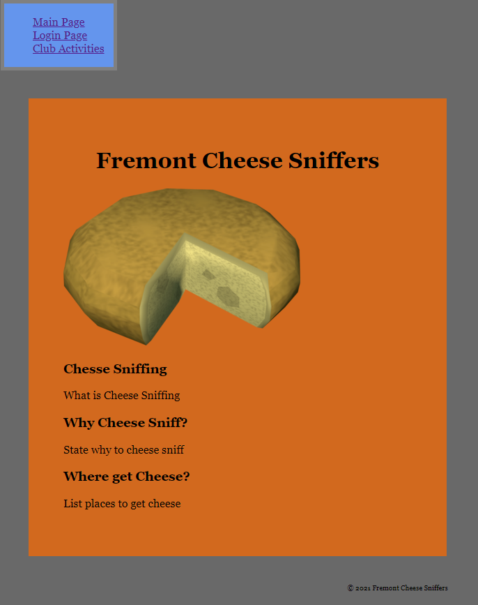
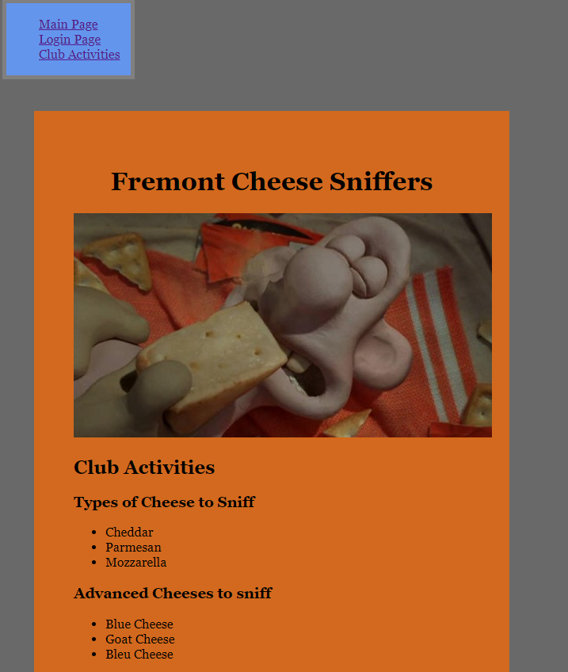
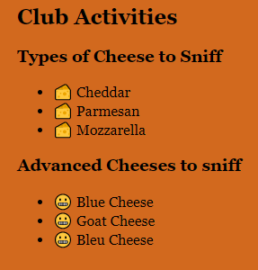
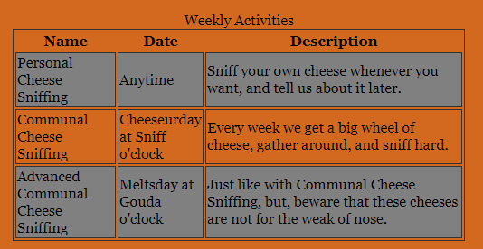

# Homework #3 Solution
Matthew Stanford

NetID: gd9687

## Question 1
### 1a.
The main page and the club activities page has an image each.





### 1b.

The emojis used were cheese (dec: 128556 ||| hex: x1F9C0) and grimacing (dec: 128556 ||| hex: x1F62C)


### 1c.

need to revist, maybe did wrong, but pages look fine
```css
            nav li{
                
                list-style-type: none;
                text-decoration: none;
                
            }
```

## Question 2

### 2a.
Completed.

### 2b.

Note that some things were done out of order, which is why this table already has some styling.


```HTML
            <table>
                    <caption>Weekly Activities</caption>
                <tr>
                    <th>Name</th>
                    <th>Date</th>
                    <th>Description</th>
                </tr>
                <tr>
                    <td>Personal Cheese Sniffing</td>
                    <td>Anytime</td>
                    <td>Sniff your own cheese whenever you want, and tell us about it later.</td>
                </tr>
                <tr>
                    <td>Communal Cheese Sniffing</td>
                    <td>Cheeseurday at Sniff o'clock</td>
                    <td>Every week we get a big wheel of cheese, gather around, and sniff hard.</td>
                </tr>
                <tr>
                    <td>Advanced Communal Cheese Sniffing</td>
                    <td>Meltsday at Gouda o'clock</td>
                    <td>Just like with Communal Cheese Sniffing, but, beware that these cheeses are not for the weak of nose. </td>
                </tr>
            </table>
```

### 2c.



```CSS
            table,
            td {
                border: 1px solid #333;
                width 50%;
            }

            thead,
            tfoot {
                text-align: center;
                color: solid #333;
            }
            
            tr:nth-child(even) {
                background-color: #808080;
            }
```

## Question 3
### 3a.
